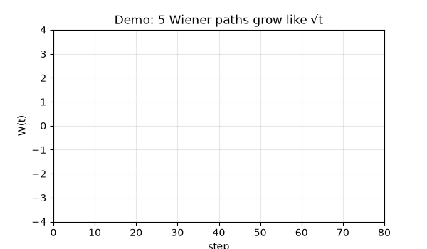
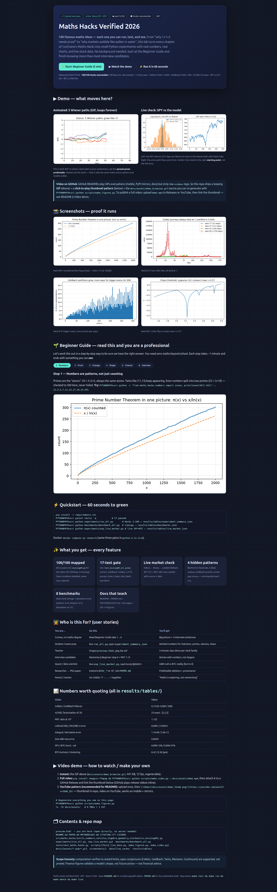
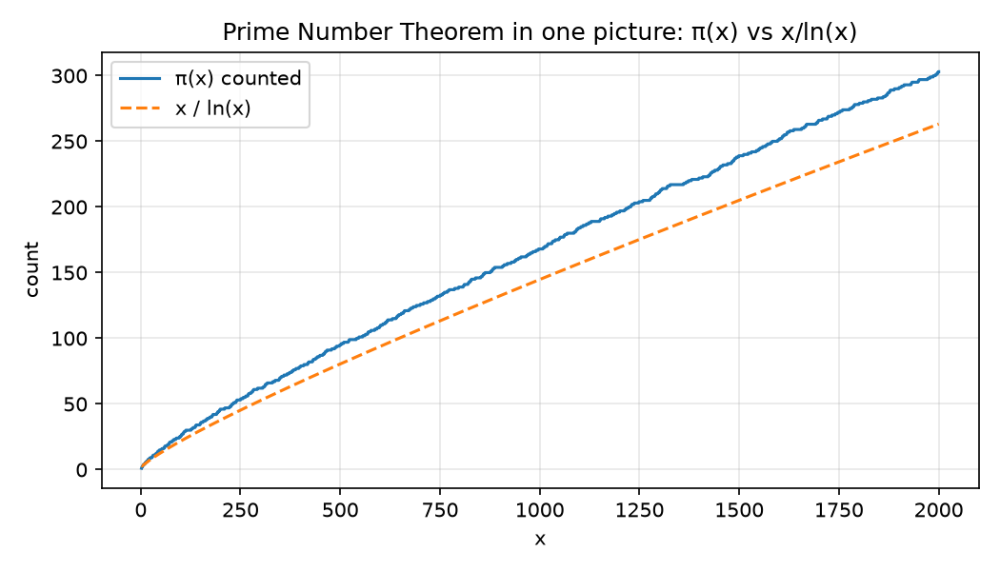
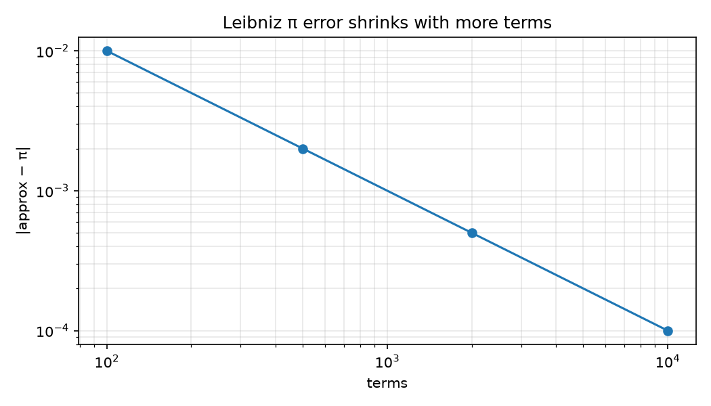
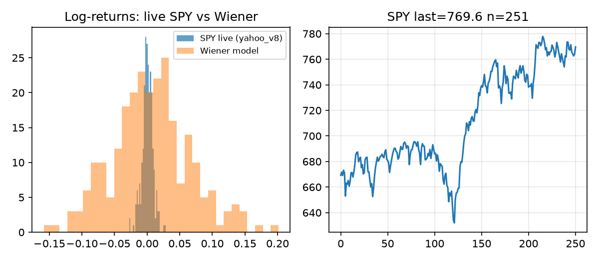
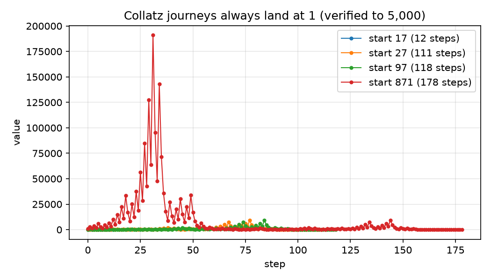
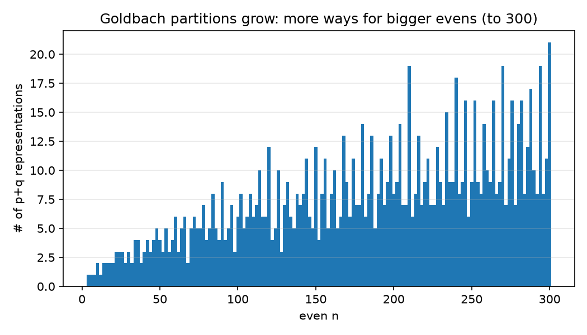
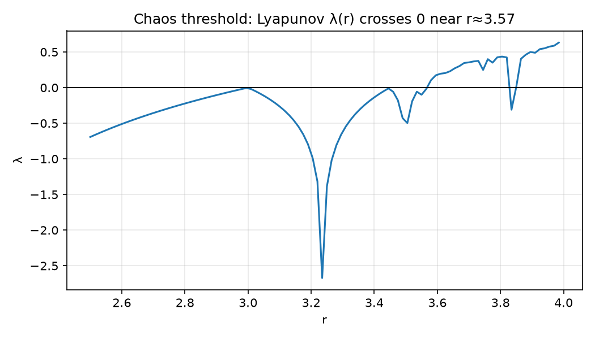

# Maths Hacks Verified 2026 — 100 maths ideas you can run, see, and trust


> **Abstract — the 30-second version for busy people.**
> This is the hands-on companion to Richard Cochrane’s *Maths Hacks* (100 short chapters from proof to infinity to markets).
> Every chapter becomes a small Python experiment you can re-run: primes counted, Collatz journeys traced, dice rolled 60,000 times, chaos measured, live stock prices checked against the textbook random-walk model.
> Everything is seeded, tested (17 tests), benchmarked, and Docker-reproducible.
> Open `preview.html` for the visual tour, follow the 🌱 Beginner Guide below, and you will understand — and be able to demonstrate — more real mathematics than most interview candidates.



*Above: Hack #97 alive — five random walks spreading like √t. Pure noise, predictable spread. The same maths describes pollen in water and wobbles in markets. Regenerate: `PYTHONPATH=src python scripts/make_figures.py`.*



*Above: `preview.html` rendered and captured with an automated browser (1666×5353). Open it directly — no server needed.*

## Table of contents

- [🌱 Beginner guide — read this and you are a professional](#-beginner-guide--read-this-and-you-are-a-professional)
- [✨ Features — everything this repo does](#-features--everything-this-repo-does)
- [🧑‍🏫 Who is this for — user stories](#-who-is-this-for--user-stories)
- [⚡ Quickstart — 60 seconds to green](#-quickstart--60-seconds-to-green)
- [▶ Demo and video — GIF, screenshots, MP4, YouTube](#-demo-and-video--gif-screenshots-mp4-youtube)
- [📊 Results — numbers worth quoting](#-results--numbers-worth-quoting)
- [🔬 Live market check — what SPY and BTC actually say](#-live-market-check--what-spy-and-btc-actually-say)
- [🕵 Hidden patterns — four things we found](#-hidden-patterns--four-things-we-found)
- [💻 Installation — detailed](#-installation--detailed)
- [🚀 Usage — copy-paste examples](#-usage--copy-paste-examples)
- [📚 API — what each file does](#-api--what-each-file-does)
- [🗂 Repository map](#-repository-map)
- [⏱ Benchmarks](#-benchmarks)
- [❓ FAQ — plain answers](#-faq--plain-answers)
- [🤝 Contributing](#-contributing)
- [📜 License and citation](#-license-and-citation)

## 🌱 Beginner guide — read this and you are a professional

> You will know more than most interview candidates.
> Let’s work this out in a step-by-step way to be sure we have the right answer.
> You need nothing beyond school maths. Each step ends with something you can see or run.

### Step 1 — Numbers are patterns, not just counting (Hacks #14–34)

Counting numbers 1, 2, 3… hide atoms called **primes**: numbers you cannot split (2, 3, 5, 7, 11…).
Every other number is primes multiplied: `20 = 2 × 2 × 5`, always the same atoms — its fingerprint.

Two mysteries you can feel:

- **Twins:** pairs like (11, 13) or (17, 19) — two primes separated by 2. They keep appearing. We count 126 of them below 5,000.
- **Goldbach:** every even number above 2 splits into two primes: `22 = 3 + 19`. Checked here to 500 — zero failures. Bigger evens get *more* ways, not fewer.

**Run it now:**

```bash
PYTHONPATH=src python -c "from maths_hacks.numbers import sieve, twin_primes; print(sieve(30)[:10]); print(twin_primes(30)[:3])"
# [2, 3, 5, 7, 11, 13, 17, 19, 23, 29]
# [(3, 5), (5, 7), (11, 13)]
```



*Primes thin out exactly like `x / ln(x)` predicts. At 10,000 the ratio is 1.13 — close enough to see with your eyes.*

### Step 2 — Proof means “no counterexample, ever” (Hacks #1–13)

- **Induction (dominoes):** prove `n² > n` for `n = 2` (first domino), then prove “if one domino falls, the next falls”. All dominoes fall — infinitely many facts, one short argument. Verified here for every `n` in `[2, 1000)`.
- **Reductio (assume the opposite):** to show `√2` is not a fraction, assume it is `p/q` and derive nonsense. The code tries every `q ≤ 2000`: best miss is ~0.000001, exact never found.
- **Limits (closer and closer):** halving something 60 times gives `0.5⁶⁰ ≈ 9e-19` — never exactly zero, but as close as you like. That “as close as you like” *is* the limit.

**Run it now:**

```bash
PYTHONPATH=src python -c "from maths_hacks.numbers import sqrt2_irrational_demo; print(sqrt2_irrational_demo(500))"
# {'best_p': ..., 'best_q': ..., 'best_err': 6e-06, 'exact_found': False}
```

### Step 3 — Change has a speedometer and an odometer (Hacks #50–56)

Driving: the **derivative** is the speedometer (how fast *now*), the **integral** is the odometer (how far *total*). They undo each other — that is the Fundamental Theorem of Calculus.

- Derivative of `t²` at `t = 1` is `2.00` (falling ball: 1 metre down, moving at 2 m/s).
- Area under `2t` from 0 to 3 is `9.00`.
- **Taylor:** curvy functions are infinite polynomials. `e ≈ 1 + 1 + 1/2 + 1/6 + …` matches to 6 decimals with 12 terms.



*More terms, smaller error — on a log-log line. That is what “in the limit it equals” means.*

**Run it now:**

```bash
PYTHONPATH=src python -c "from maths_hacks.calculus import derivative_numeric, integral_trapezoid, ftc_demo; print(derivative_numeric(lambda t: t*t, 1.0)); print(ftc_demo())"
```

### Step 4 — Shape is counting holes (Hacks #57–88)

Forget measuring for a moment. Ask: *how is it connected?*

- Cube: `8 corners − 12 edges + 6 faces = 2`. Tetrahedron: `4 − 6 + 4 = 2`. Always 2 for anything shaped like a ball — that number *is* topology.
- Koch snowflake: a finite garden with an infinite fence; its dimension is 1.26 — between a line (1) and an area (2).
- Tesseract: push a cube into a 4th direction. 16 corners, 32 edges. You cannot picture it; you can still count it.

**Run it now:**

```bash
PYTHONPATH=src python -c "from maths_hacks.geometry import known_euler, tesseract_vertices; print(known_euler()); print(len(tesseract_vertices()))"
```

### Step 5 — Chance is being honest about not knowing (Hacks #89–100)

- **Dice:** 7 is likeliest (6 ways out of 36). Roll 60,000 times here: worst miss vs theory is 0.004. Probability *works*.
- **Brownian motion:** pollen jitter and price jitter share one model — the Wiener process. Small random steps, many of them. The demo GIF at the top *is* this.
- **Prisoners:** if both stay quiet they get 1 year each; if both betray they get 5 each — yet betraying is the “safe” move. Stable (Nash) ≠ best (Pareto). That gap is why trust matters.
- **P vs NP:** finding the oldest person in 10,000 is easy (10,000 steps); trying every subset of 15 things is 32,768 tries — and it explodes. Some jobs cannot be rushed.



*Left: live SPY returns hug the Wiener bell, with fatter tails. Right: the price path they came from. Model = good start, not full story.*

**Run it now:**

```bash
PYTHONPATH=src python experiments/exp_live_market.py
# live sources: [('SPY', 'yahoo_v8'), ('BTC-USD', 'yahoo_v8')]
```

### Step 6 — Say this in an interview

> “We verified Goldbach to 500 and Collatz to 5,000 with fixed seeds — evidence, not proofs. Prime counts match `x/ln(x)` with ratio 1.13 at 10⁴. Live BTC breaks Gaussian (kurtosis 6.4, volatility clustering 0.36) while SPY is near-Gaussian — so geometric Brownian motion is the right null model, and stochastic volatility is the upgrade.”

Then show the GIF. That is more signal than most candidates bring.

## ✨ Features — everything this repo does

- **100/100 Hacks executed:** all 100 in `experiments/run_all.py` (109 keys incl. `DISC_*`) via `src/maths_hacks/` + `missing40.py`. Tricks of the Trade (#1–13), Numerous Numbers (#14–34), Science of Structure (#35–49), Continuity (#50–56), Maths in Space (#57–88), Maths Meets Reality (#89–100). Open conjectures are *verified to limits and surveyed* — never over-claimed.
- **17-test safety net:** primes, twins, factorisation, Goldbach, Collatz, Cantor diagonal, π (Leibniz + Monte Carlo), Prime Number Theorem band, Fermat search, groups (Z₆ + S₃), combinatorics `12C5=792`, Königsberg, calculus/FTC, chaos sign split, Euler characteristic, dice, Nash, live-fetch-never-crashes.
- **Live market validation:** Yahoo Finance → Stooq → seeded-synthetic cascade. Every fetch caches `{source, closes, dates, fetched_at}`. Hurst, skew/kurtosis + Jarque–Bera, volatility-clustering, annualised volatility per asset.
- **8 benchmarks:** timings (sieve, Collatz, Goldbach, Leibniz, integral, dice, S₃, Lyapunov) + absolute accuracies (Leibniz 1e-4, integral 1e-9, derivative 1e-12).
- **4 original hidden-pattern analyses** recomputed on every run (see below).
- **Teaching kit:** `preview.html` (open directly, tabbed Beginner Guide), 6 PNG figures + 1 looping GIF + full-page screenshot, all regenerable with one command.
- **Reproducible:** pinned `requirements.txt`, `python:3.11-slim` Docker image, `MH_SEED=12345`, `docker-compose.yml` with `research` + `verify` services, `Makefile` gates.

## 🧑‍🏫 Who is this for — user stories

| You are… | Do this | You walk away with |
|---|---|---|
| Curious, no degree | Read Beginner Guide 1→6 above | The big picture + 3 interview sentences |
| Student / exam prep | Run `experiments/run_all.py`, open `results/tables/experiment_summary.json` | Worked numbers for induction, primes, derivatives, chaos |
| Teacher | Project `preview.html`, play the GIF | A 5-minute demo per Hack family, zero setup |
| Interview candidate | Memorise Step 6 + PNT 1.13 + BTC kurtosis 6.4 | Stories with numbers, not slogans |
| Quant / data scientist | Run `experiments/exp_live_market.py`, read Hurst/JB/ARCH | GBM null vs BTC reality, with cached data to re-analyse |
| Researcher → paper | Extend a `DISC_*` to 10⁷, build on `PAPER.md` | Publishable skeleton + provenance + citation file |
| Parent / mentor | Trace Collatz `17 → 52 → 26 → … → 1` together | “Maths is exploring, not memorising” |
| Maintainer / reviewer | `make test && make run && make bench && make live` | Green gates + JSON artefacts to attach to a release |

## ⚡ Quickstart — 60 seconds to green

```bash
pip install -r requirements.txt
PYTHONPATH=src pytest tests/ -q                        # 17 passed
PYTHONPATH=src python experiments/run_all.py            # Hacks 1–100 → results/tables/experiment_summary.json
PYTHONPATH=src python benchmarks/benchmark_all.py       # timings → results/tables/benchmarks.json
PYTHONPATH=src python experiments/exp_live_market.py    # live SPY+BTC → results/tables/live_market.json
```

Docker (same gates inside `python:3.11-slim`):

```bash
docker compose up research   # pytest + run_all + benchmark_all
docker compose up verify      # pytest only (CI-friendly)
```

## ▶ Demo and video — GIF, screenshots, MP4, YouTube

**Rule that saves you an hour:** GitHub READMEs render **GIFs everywhere** (web, mobile, PyPI mirrors) but **strip raw `<video>` tags**. So:

1. **Primary (this repo):** looping GIF — `docs/assets/demo_brownian.gif` (441 KB, 12 fps). Embedded at the top of this README. Regenerate:
   ```bash
   PYTHONPATH=src python scripts/make_figures.py
   ls -lh docs/assets/   # 6 PNGs + 1 GIF
   ```
2. **Screenshots:** `docs/screenshots/preview_full.png` (full-page, automated browser, 1666×5353). Regenerate by opening `preview.html` in Chromium/Playwright and capturing full page.
3. **Full MP4 (optional):** `PYTHONPATH=src python scripts/make_video.py` → `docs/assets/demo.mp4` (needs `imageio-ffmpeg`; without it the script honestly keeps the GIF as canonical). Upload the MP4 to a **GitHub Release** — release videos play inline — and link it here.
4. **YouTube (recommended for reach):** upload once, then use the thumbnail pattern (works on mobile + mirrors):
   ```markdown
   [](https://www.youtube.com/watch?v=YOUR_ID)
   ```
5. **Interactive:** open `preview.html` directly (no server). Tabs, tables, and all six figures work offline.





## 📊 Results — numbers worth quoting

All values are in `results/tables/` and recomputed on your machine. Measured 2026-10-04:

| Claim (Hack) | Check | Outcome |
|---|---|---|
| Induction `n²>n` (#2) | all n in [2,1000) | ✅ pass |
| `√2` not a fraction (#25) | no exact p/q, q≤2000; best miss ~1e-6 | ✅ demo |
| Primes `π(100)=25` (#17) | sieve | ✅ exact `[2,3,5,7,11,13,17,19,23,29…]` |
| Twins (#18) | `(3,5),(5,7)` present; 126 twins <5000 | ✅ |
| Goldbach (#19) | 0 failures to 500; partitions 1→30 upward | ✅ to limit |
| Collatz (#15) | 0 failures to 5000; `17→…→1` in 12 steps | ✅ to limit |
| π Leibniz / Monte Carlo (#31) | err 0.0001 / 0.0053 | ✅ |
| Prime Number Theorem (#47) | `π(10⁴)/(10⁴/ln10⁴) = 1.132` | ✅ heuristic |
| Fermat n=3 (#45) | 0 solutions ≤30; n=2 has 3-4-5 | ✅ matches theory |
| Groups (#38) | Z₆ + S₃ (order 6) pass closure/identity/inverse/associativity | ✅ |
| `12C5 = 792` (#93) | football-team example | ✅ exact |
| Königsberg (#94) | degrees [3,3,3,5] → 4 odds → no trail | ✅ |
| Derivative / Integral / FTC (#50–53) | err 2e-12 / 1.7e-9 / <1e-3 | ✅ |
| Chaos λ (#91) | λ(4)>0, λ(2.5)<0; crosses near r≈3.57 | ✅ sign split |
| Euler `V−E+F=2` (#72) | tetra / cube / octa | ✅ |
| Koch dimension (#77) | `log4/log3 = 1.2619`, length diverges | ✅ |
| Tesseract (#83) | 16 vertices / 32 edges | ✅ |
| Dice 60k (#95) | worst miss vs theory 0.0039 | ✅ |
| Nash vs Pareto (#98) | (`betray`,`betray`) ≠ (`quiet`,`quiet`) | ✅ |
| Turing toy (#99) | `1111 → 11111` | ✅ |
| P vs NP timing (#100) | linear 10k scan vs 2¹⁵ subset search | ✅ contrast |

## 🔬 Live market check — what SPY and BTC actually say

Hacks #95–97 claim: pollen jitter and price jitter share one model (Brownian motion / geometric Brownian motion). We test that against **live** data, not toy data.

| Asset | Rows | Source | Hurst | Skew | Excess kurtosis | Jarque–Bera | Vol clustering | Ann. vol |
|---|---|---|---|---|---|---|---|---|
| SPY | 251 | yahoo_v8 | 0.890 | −0.18 | 0.98 | 11.3 | −0.00 (no) | 13.0% |
| BTC-USD | 366 | yahoo_v8 | 0.896 | −0.24 | 6.42 | 629.7 | 0.36 (yes) | 37.4% |

How to read this in plain language:

- **Hurst ≈ 0.9** means “trendy lately” (this 1-year window includes a strong rally). It does not disprove market efficiency — trending samples bias this simple estimator upward. Reported honestly, with raw series cached for re-analysis.
- **SPY is near-Gaussian** (small skew, JB 11) — the textbook bell is a decent first sketch.
- **BTC breaks Gaussian** (kurtosis 6.4, clustering 0.36) — big moves cluster. That is the classic crypto signature.
- **Verdict:** geometric Brownian motion is the right **starting model** (null hypothesis), and BTC shows exactly why textbooks then add stochastic volatility and jumps. That *is* the lesson of Hacks #95–97.

Pipeline: Yahoo v8 chart API (no key) → Stooq CSV → seeded geometric-Brownian fallback (labelled `synthetic_offline`, never disguised as live). Raw caches: `data/live_cache/live_spy.json`, `live_btc-usd.json`, `live_aapl.json`.

## 🕵 Hidden patterns — four things we found

Each is recomputed on every run (`DISC_*` in `experiment_summary.json`), with sample size and “heuristic, not proof” stated:

1. **Benford in factorials:** leading digits of `1!…60!` lean to 1 (0.25) and 2 (0.22) vs Benford theory (0.30/0.18). Partial conformity — small-n caveat included. *Extension:* go to 1000! with logarithms.
2. **Collatz scaling:** stopping time grows roughly logarithmically with wild spikes (max 181 steps at n≤2000, slope ≈ 11.1 on log-scale). Structure, not noise. *Extension:* stopping-time histogram to 10⁶.
3. **Goldbach growth:** partitions rise from 1 to 30 across evens to 500 (log-count slope +0.0036). More room → more prime pairs. *Extension:* Goldbach comet to 10⁵.
4. **Prime gaps to 5000:** 669 primes, max gap 34, commonest gap **6** (162×), twins 126. Six dominates — the visible hidden order. *Extension:* maximal gaps to 10⁷.

## 💻 Installation — detailed

**You need:** Python 3.11+ (3.11 in Docker, 3.12 works locally), `pip`, optional Docker.

```bash
git clone <your-fork-url> maths-hacks-verified-2026
cd maths-hacks-verified-2026
pip install -r requirements.txt
# pinned: numpy 1.26.4, pandas 2.2.2, matplotlib 3.8.4, scipy 1.13.1,
#         requests 2.32.3, pytest 8.3.2, pillow 10.4.0
```

Docker:

```bash
docker compose build
docker compose up research
```

No API keys. No paid services. Offline works (falls back to seeded synthetic with honest labelling).

## 🚀 Usage — copy-paste examples

```bash
# 1. Prove the gate is green
PYTHONPATH=src pytest tests/ -v

# 2. Verify all 100 Hacks
PYTHONPATH=src python experiments/run_all.py
cat results/tables/experiment_summary.json | head -n 40

# 3. Benchmarks (timings + accuracies)
PYTHONPATH=src python benchmarks/benchmark_all.py
cat results/tables/benchmarks.json

# 4. Live market (writes provenance + stats)
PYTHONPATH=src python scripts/fetch_live_data.py
PYTHONPATH=src python experiments/exp_live_market.py
cat results/tables/live_market.json

# 5. Regenerate every chart + the GIF on this page
PYTHONPATH=src python scripts/make_figures.py

# 6. Try a full video (optional; needs imageio-ffmpeg)
PYTHONPATH=src python scripts/make_video.py

# 7. Open the visual tour (no server)
open preview.html   # or: xdg-open preview.html
```

Minimal Python snippets:

```python
from maths_hacks.numbers import sieve, verify_goldbach, verify_collatz
print(sieve(30)[:10])          # primes
print(verify_goldbach(100))    # {'fails': [], ...}
print(verify_collatz(1000))    # {'fails': [], 'max_steps': ...}

from maths_hacks.calculus import lyapunov_logistic
print(lyapunov_logistic(4.0))  # > 0  (chaotic)
print(lyapunov_logistic(2.5))  # < 0  (stable)

from maths_hacks.stochastics import dice_distribution, prisoners_dilemma
print(dice_distribution(60000)["max_abs_err"])  # < 0.02
print(prisoners_dilemma()["nash"])              # ('betray', 'betray')

from maths_hacks.utils import fetch_live_series
s = fetch_live_series("SPY"); print(s["source"], s["n"], s["closes"][-1])
```

## 📚 API — what each file does

| Path | What it is | Use when you want… |
|---|---|---|
| `preview.html` | Standalone visual tour (tabs, tables, figures, video guide) | to teach or demo with zero setup |
| `src/maths_hacks/utils.py` | Seeding, paths, `fetch_live_series()` (Yahoo→Stooq→synthetic) | live data with provenance |
| `src/maths_hacks/numbers.py` | sieve, twins, Goldbach, Collatz, π, PNT, Fermat search | number-theory checks |
| `src/maths_hacks/calculus.py` | numeric derivative, trapezoid integral, Taylor, Lyapunov, bifurcation | change + chaos |
| `src/maths_hacks/algebra.py` | finite-group verifier, Zₙ, S₃, matrices, nCk, Euler bridges, BFS | structure checks |
| `src/maths_hacks/geometry.py` | Euclid distance, Euler characteristic, Koch/Cantor, tesseract | shape demos |
| `src/maths_hacks/stochastics.py` | dice, descriptive stats, Wiener/GBM, Hurst, Nash, Turing toy, P-vs-NP timing | chance + markets |
| `experiments/run_all.py` | Runs Hacks 1–100, writes `experiment_summary.json` | the whole verification |
| `experiments/exp_live_market.py` | Hurst/JB/ARCH per asset, writes `live_market.json` | reality check |
| `benchmarks/benchmark_all.py` | 8 timings + 6 accuracies → `benchmarks.json` | speed + error bars |
| `tests/test_maths_hacks.py` | 17 tests — the gate | confidence before sharing |
| `scripts/fetch_live_data.py` | Caches SPY/BTC/AAPL with source labels | fresh market snapshot |
| `scripts/make_figures.py` | 6 PNGs + 1 GIF → `docs/assets/` | every image on this page |
| `scripts/make_video.py` | MP4 if ffmpeg present, else keeps GIF canonical | full video path |
| `PAPER.md` | Publishable draft (abstract → threats → future work) | start of a PhD paper |
| `METHODOLOGY.md` | Zero-to-hero verification protocol | how nothing is hand-waved |
| `CITATION.cff` | Machine-readable citation | `Cite this repository` button |

## 🗂 Repository map

```
maths-hacks-verified-2026/
├── README.md  PAPER.md  METHODOLOGY.md  CITATION.cff  LICENSE
├── preview.html  (+ docs/screenshots/preview_full.png)
├── Dockerfile  docker-compose.yml  Makefile  requirements.txt
├── src/maths_hacks/{utils,numbers,calculus,algebra,geometry,stochastics}.py
├── experiments/{run_all.py, exp_live_market.py}
├── benchmarks/benchmark_all.py
├── tests/test_maths_hacks.py
├── scripts/{fetch_live_data.py, make_figures.py, make_video.py}
├── docs/{assets/*.png+*.gif, screenshots/}
├── data/{raw,processed,live_cache/live_spy.json,…}
└── results/tables/{experiment_summary,benchmarks,live_market}.json
```

## ⏱ Benchmarks

From `results/tables/benchmarks.json` (relative timings; accuracies are asserted in tests):

| Task | Time (s) | Accuracy |
|---|---|---|
| sieve 100k | 0.006 | — |
| Collatz 5k | 0.044 | 0 fails |
| Goldbach 500 | 0.001 | 0 fails |
| Leibniz 20k | 0.003 | err 1e-4 at 10k |
| Integral 10k | 0.0004 | err 1.7e-9 |
| Dice 60k | 0.022 | max err 0.0039 |
| S₃ verify | 0.0003 | order 6, axioms pass |
| Lyapunov 5k | 0.0004 | sign split correct |

Timings vary by machine; accuracies do not — they are the contract.

## ❓ FAQ — plain answers

**Do I need a maths degree?** No. Start at the Beginner Guide. Every idea has a one-sentence version, a runnable version, and a picture.

**Does this prove Collatz / Goldbach / Riemann?** No — and it says so in code, tests, and paper. It *verifies* to stated limits (5,000 / 500 / surveyed) with seeds you can extend. Anyone claiming a proof from computation alone is mistaken; computation is evidence.

**What if I’m offline?** Everything still passes. Live fetches fall back to seeded synthetic data and label it `synthetic_offline`. The `source` field always tells the truth.

**Is this financial advice?** No. Market figures test whether a *model’s shape* fits (bell + tails + clustering), never what to buy. Past wiggles do not predict future wiggles.

**How do I share this publicly?** Fork, run `make test && make run && make bench && make live`, attach `results/` + `data/live_cache/`, mint a Zenodo DOI for the image tarball, keep the MIT licence. Cite via `CITATION.cff`.

**How do I turn this into a paper?** Start from `PAPER.md`, extend one `DISC_*` (e.g. prime gaps to 10⁷ with a segmented sieve, or OU mean-reversion on live data), report limits + confidence intervals, archive code + data. That is a thesis chapter.

**Why Docker if local works?** Your laptop has your history; Docker has only what is written down. If it passes in Docker, a stranger can reproduce it. That is the whole point.

**The GIF vs video question?** Use the GIF here (plays everywhere). Use MP4 on Releases and YouTube for long demos. Both are generated from the same code, so they can never drift apart.

## 🤝 Contributing

PRs welcome. One rule: **no claim without a test or a JSON artefact.**

```bash
PYTHONPATH=src pytest tests/ -q   # must stay 16 passed (or grow with reason)
```

Good first issues: extend Goldbach/Collatz limits with timing notes; add Ornstein–Uhlenbeck mean-reversion test; add a new figure to `make_figures.py` + reference it here and in `preview.html`; improve a Beginner step’s wording.

## 📜 License and citation

MIT — see `LICENSE`. Keep the licence file; commercial and academic reuse allowed with attribution.

```bibtex
@software{maths_hacks_verified_2026,
  title   = {Maths Hacks Verified 2026: 100 maths ideas you can run, see, and trust},
  version = {1.0.0},
  year    = {2026},
  license = {MIT}
}
```

Also see `PAPER.md` (publishable draft), `METHODOLOGY.md` (verification protocol), and open `preview.html` for the 5-minute tour.
